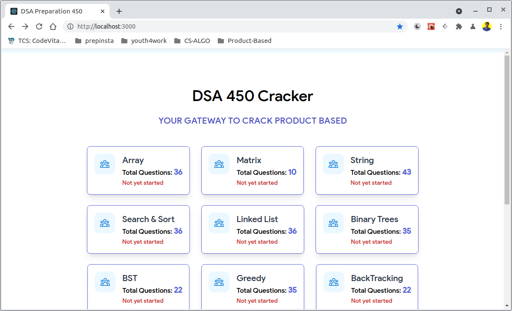

# ❤️ 450DSA-Tracker - React + IndexedDB
Have you cached your answers?

## Pending Jobs:
[x] Uncheck questions  also works! Kudos to [Vaibav](https://github.com/vaibhavmehra9)

This project was bootstrapped with [Create React App](https://github.com/facebook/create-react-app).

## Project Showcase - 450DSA-Tracker

## Available Scripts

In the project directory, you can run:

### `npm start`

Runs the app in the development mode.\
Open [http://localhost:3000](http://localhost:3000) to view it in the browser.

## Project Showcase - About -Section

### `npm test`

Launches the test runner in the interactive watch mode.\
See the section about [running tests](https://facebook.github.io/create-react-app/docs/running-tests) for more information.

### `npm run build`
See the section about [deployment](https://facebook.github.io/create-react-app/docs/deployment) for more information.

### `npm run eject`

## Project Description

450 DSA Cracker helps you build your confidence in solving any coding related question and helps you prepare for your placements 👨🏻‍🎓.
Data Structures and Algorithms are used to test the analytical skills of the candidates as they are a useful tool to pick out the underlying algorithms in real-world problems and solve them efficiently. ❤️

## Author

flock.sinasini@gmail.com

## **Prerequisite(s)**

* React
    - Popular JavaScript Library for building Frontend UIs
* Context API + Custom Hooks
    -   Context API is a component structure provided by the React framework, which enables us to share specific forms of data across all levels of the application.
* TypeScript
    - An open-source language which builds on JavaScript, one of the world's most used tools, by adding static type definitions.
* IndexedDB Browser
    - low-level API for client-side storage of significant amounts of structured data)

## **Skills to be learned**

* React
* ContextAPI
* Hooks
* IndexedDB
* Typescript

## **Focus** 

Web-based Personalized Tracker for 450 DSA curated questions by babbar

## **Objective** 

Data Structures and Algorithms are used to test the analytical skills of the candidates as they are a useful tool to pick out the underlying algorithms in real-world problems and solve them efficiently.

## Project Context 

Data structure is a process through which data is stored and arranged in the disk space of the computer or memory storage, in a way that the data can be easily used and manipulated in the future. It is an effective way of performing various operations related to data management.
 

With a sufficient understanding of data structure data can be organized and stored in a proper manner. Data structures are designed to organize data in order to suit specific purposes so as to access and perform operations in an appropriate manner.
 

You will this project with React using Typescript. I learned to react for a few months and very much influenced, yet simple project using Context and reducer, and use Browser realtime IndexDB, that means the app does not have a physical database, it caches.

